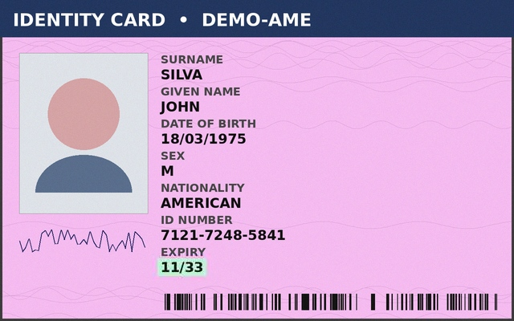
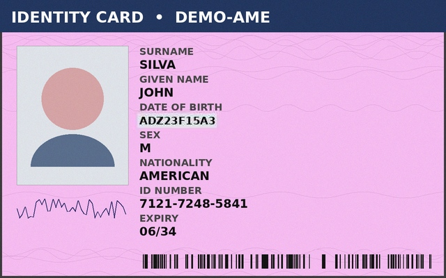
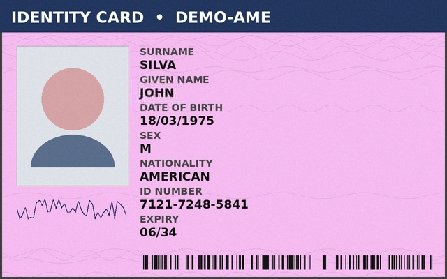

# DocuGuard — Synthetic ID-Document Forgery Detection

A from-scratch, end-to-end machine learning system that detects tampered
identity documents: synthetic data generation, forensic feature engineering
(Error Level Analysis), a two-branch CNN fusion model, explainability
(Grad-CAM), a served REST API, and a browser demo.

Built as a portfolio project targeting document-verification / fraud-detection
ML engineering roles — the problem shape (spot manipulated identity documents
at upload time) mirrors what KYC/identity-verification platforms solve in
production.

## Why synthetic data?

Real government-issued ID documents are sensitive PII. They can't legally be
scraped, redistributed, or used to train a portfolio project. Rather than
skip the problem, this project builds the data generation pipeline itself:
a synthetic ID-card renderer (`src/synth_id_generator.py`) produces
plausible, fully fake identity cards — no real names, no real faces (the
"photo" is a generic programmatic avatar silhouette), no real ID numbers —
and a tampering simulator (`src/tamper.py`) applies four realistic forgery
techniques on top of them. This mirrors how real identity-verification
companies actually train and stress-test forgery detectors: synthetic /
programmatically generated documents are the standard approach precisely
*because* real ID data is off-limits for training.

## Sample data

| Authentic | Splice | Copy-move | Retype | Recompress |
|---|---|---|---|---|
|  |  |  |  |  |

All fully synthetic — fabricated names, fabricated ID numbers, generic
avatar silhouette instead of a real photo.

## Problem & approach

Given a photo of an ID document, predict whether it has been tampered with,
and — via Grad-CAM — show *where* the model thinks the tampering happened.

**Attack types simulated** (`src/tamper.py`):
| Attack | What it does |
|---|---|
| `splice` | Pastes a field region from a *different* synthetic card (e.g. a swapped name or ID number) |
| `copy_move` | Duplicates a region of the *same* card onto another spot (e.g. hiding original content) |
| `retype` | Erases a text field and re-renders it with different font/weight — simulates a crudely edited field |
| `recompress` | Locally re-JPEG-compresses a patch at a different quality than the rest of the image |

Every tampered image also gets a **baked-in double-compression artifact**
over the edited region (`inject_compression_artifact` in `tamper.py`) —
this is what makes Error Level Analysis able to detect the region at all,
and it mirrors what happens when a real forger copies content from another
(already-compressed) image or re-saves an edited region out of a photo
editor.

## Pipeline

```
src/synth_id_generator.py   synthetic ID-card renderer (no real people/PII)
src/tamper.py                4 forgery simulators + compression-artifact injection
src/build_dataset.py         generates the full labeled dataset + manifest.csv
src/features.py               Error Level Analysis + template-ROI forensic features
src/classical_baseline.py    Random Forest on hand-crafted features (baseline)
src/dataset.py                PyTorch Dataset (RGB + ELA tensors)
src/model.py                  two-branch fusion CNN (trained from scratch)
src/train.py                   training loop
src/evaluate.py                test-set metrics, ROC curve, confusion matrix
src/gradcam.py                 Grad-CAM localization + bbox-overlap sanity check
src/api.py                     FastAPI serving layer
demo/index.html                 browser upload-and-analyze demo
```

## Model design

**Two-branch fusion CNN**, trained end-to-end:

- **RGB branch**: a compact conv stack over the 160×160 document image —
  learns appearance/layout cues.
- **ELA branch**: a compact conv stack over the 96×96 Error-Level-Analysis
  map — learns the localized forensic double-compression artifact.
- **Fusion head**: concatenated embeddings → small MLP → tampered/authentic
  logit.

**Why trained from scratch, not fine-tuned from ImageNet:** the environment
this was originally built in has no outbound network access to download
pretrained weights (a real constraint worth designing around, not just a
local quirk — CI runners and air-gapped environments have the same
restriction). Since the visual domain here is a single, fixed ID-card
template rather than general natural images, a compact from-scratch CNN is
enough to learn it well, and the whole project stays reproducible with zero
external downloads — clone, `pip install -r requirements.txt`,
`python src/build_dataset.py`, `python src/train.py`, done.

**Classical baseline:** hand-crafted, template-ROI-aware ELA/noise features
(mean/max ELA and Laplacian noise variance at each of the ten known
template regions: photo box, each of the 7 text fields, signature, barcode)
fed into a Random Forest. Whole-image *global* ELA statistics turned out to
have essentially no discriminative power here (~0.01–0.04 effect size) —
because every card, tampered or not, already has naturally high-frequency
regions (crisp text, barcode bars) that dominate a global statistic. Scoping
the features to the fixed template's known ROIs recovered a real, if modest,
signal. This ablation is in `notebooks/` and is exactly the kind of finding
that motivates using a spatially-aware model (the CNN) instead of hand-tuned
global statistics.

## Results

Trained for 12 epochs on CPU (~32 min) on 2,800 train / 600 val / 600 test
synthetic cards (balanced authentic/tampered).

| Model | Test Accuracy | Test ROC-AUC |
|---|---|---|
| Classical baseline (Random Forest on ROI features) | 70.2% | 0.761 |
| **DocuGuard fusion CNN** | **94.0%** | **0.990** |

Fusion CNN test set (precision 0.982, recall 0.897, F1 0.937, n=600):

```
                 predicted
                 authentic  tampered
actual authentic    295         5
actual tampered      31       269
```

**Per-attack-type recall** (tampered class, fusion CNN) — not all forgery
types are equally hard:

| Attack | Recall | Mean predicted probability |
|---|---|---|
| copy_move | 100.0% | 0.996 |
| retype | 100.0% | 0.990 |
| recompress | 93.8% | 0.908 |
| splice | 64.0% | 0.645 |

`splice` (pasting a field from a *different* card) is the hardest case —
both cards use the same rendering pipeline/fonts, so the pasted content is
often visually near-identical to genuine content, and the main giveaway is
purely the compression-history artifact rather than any visible pixel
mismatch. This is a realistic difficulty: it's the same reason splicing is
one of the harder forgery types to catch in real forensic pipelines too.

See `reports/metrics.json`, `reports/figures/confusion_matrix.png`,
`reports/figures/roc_curve.png`, and `reports/classical_baseline_results.json`
for the full generated output.

## Explainability

`src/gradcam.py` runs Grad-CAM on the ELA branch's last conv layer for a
sample of tampered test documents, overlays the resulting heatmap on the
original image, and computes what fraction of the heatmap's energy falls
inside the *known* ground-truth tamper region recorded during dataset
generation — a simple, honest way to check whether the model is actually
looking in the right place rather than pattern-matching on something
spurious.

On a sample of tampered test documents, the average tamper bbox covers
~1.1% of the card area; Grad-CAM concentrates ~4.0% of its heatmap energy
inside that region — roughly **3.6x more attention than chance** on the
correct area. That's a real, if modest, localization signal, not a sharp
bounding box: the ELA branch operates on a downsampled 96×96 map, which
caps how precisely it can localize a small tampered field. Example overlays
are in `reports/figures/gradcam_*.png`.

## Running it

```bash
pip install -r requirements.txt

# 1. Generate the dataset (fully reproducible, fixed seed, no external downloads)
python src/build_dataset.py --n 2000 --out data

# 2. Train
python src/train.py --epochs 12 --out models

# 3. Evaluate
python src/evaluate.py --ckpt models/docuguard_best.pt

# 4. Classical baseline (for comparison)
python src/classical_baseline.py

# 5. Grad-CAM examples
python src/gradcam.py

# 6. Serve the API
cd src && uvicorn api:app --reload --port 8000

# 7. Open demo/index.html in a browser (point it at http://localhost:8000)
```

### Docker

```bash
docker build -t docuguard .
docker run -p 8000:8000 docuguard
```

### Tests

```bash
pytest tests/ -v
```

## Honest limitations

- Trained and evaluated entirely on synthetic data with one fixed card
  template. It has not been tested on real, diverse document types (real
  ID/passport photos have different layouts, print/scan artifacts, and
  camera-glare/lighting variation this dataset doesn't fully capture).
  Domain-transfer to real documents would need real (properly licensed and
  privacy-compliant) evaluation data.
- The 4 tamper attacks are a reasonable but non-exhaustive set — real
  forgery techniques (deepfake face swaps on the photo, printed-then-
  rescanned documents, hologram spoofing) aren't modeled.
- The classical baseline's weak global-feature result is a genuine, reported
  negative finding, not cherry-picked — see `notebooks/`.

## Stack

Python, PyTorch, torchvision, OpenCV, scikit-learn, FastAPI, Docker.
